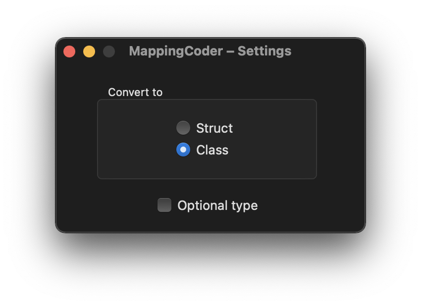

<p align="center" >
  
</p>

[](https://img.shields.io/badge/platform-macos-brightgreen)
[](https://img.shields.io/badge/macos-10.15-brightgreen)

[](https://github.com/wgy6055/MappingCoder/blob/master/LICENSE)
[](https://swift.org/)

English | [中文](README_CN.md)

🧑🏼‍💻 An Xcode Source Editor extension for [ObjectMapper](https://github.com/tristanhimmelman/ObjectMapper) user to convert JSON into Swift code.

## Features

- Convert JSON to `Mappable`
- Convert JSON to `ImmutableMappable`
- Auto Complete Mapping Methods
  - Custom mapping with attribute `@map`
- Support converting nested type
- Use lower camel case for property names
- Use `Int64` for property named `xxx(ID|Id|id)`

## Install

- macOS 10.15+
- Drag `MappingCoder.app` into `Applications` folder. 
- Open it. The extension will be installed on Xcode when the app is opened for the first time.
- In `System Preferences > Extensions > Xcode Source Editor`, selecting `MappingCoder` to activate it.

## Uninstall

Moving `MappingCoder.app` to Trash.

> Killing Xcode if there is a pop up showing "some of its extensions are in use".

## Usage

In Xcode, selecting JSON or Class/Struct Declaration. And choosing `Editor > MappingCoder > ...` to use.

## Examples

### Convert JSON to Mappable

<p align="center" >
  
</p>

### Convert JSON to ImmutableMappable

<p align="center" >
  
</p>

### Auto Complete Mapping Methods

Sometimes, there is no need to convert whole JSON to Swift code. So you can simply define properties and use `Auto Complete Mapping Methods` to generate `init(map:)` & `mapping(map:)`. If you want to customize the mapping, attribute `@map()` is provided to determine `key` & `default` for each property. 

```swift
// @map(key: String?, default: Any?)

// @map(key: "all_skills", default: [])
var skills: [Skill]
// @map(key: "user-name", default: "")
var name: String
// @map(default: [:])
var profile: [String : Any]
// @map(key: "math score")
var mathScore: Int
```

This feature is powered by [SwiftSyntax](https://github.com/apple/swift-syntax).

<p align="center" >
  
</p>

### Use Lower Camel Case & Int64

`MappingCoder` names property using lower camel case automatically. And also, defines property named `xxx(ID|Id|id)` as `Int64`.

```swift
//{
//    "user_name": "jack",
//    "user-id": 123456789
//}

class <#name#>: Mappable {

    var userId: Int64 = <#defaultValue#>
    var userName: String = <#defaultValue#>

    required init?(map: Map) {}

    func mapping(map: Map) {
        userId <- map["user-id"]
        userName <- map["user_name"]
    }
}
```

## Settings

In Xcode, choosing `Editor > MappingCoder > Settings...` to open Settings.

<p align="left" >
  
</p>

## Inspired By

- [JSON-to-Swift-Converter](https://github.com/mrlegowatch/JSON-to-Swift-Converter)
- [SwiftSyntax](https://github.com/apple/swift-syntax)
- [SwiftSemantics](https://github.com/SwiftDocOrg/SwiftSemantics)

## License

[MIT](LICENSE)
